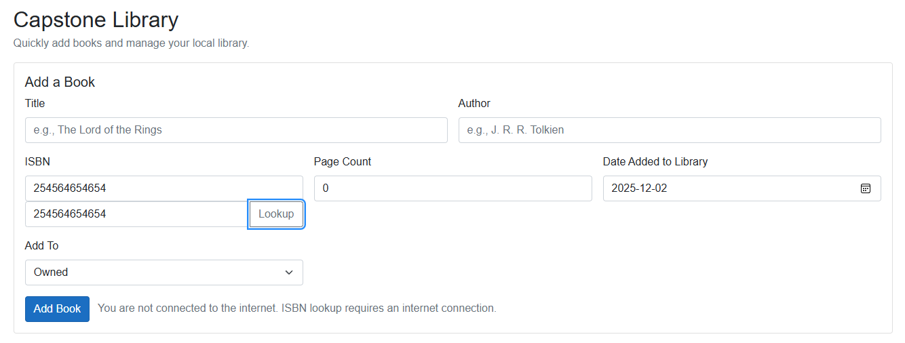

# Capstone Project
Our application is a personal book management system that helps users keep track of their reading habits and book collections.  
*When downloading and cloning the repository, be sure to change the Framework under this Windows Machine choice from net8.0 to net9.0-windows*

A lightweight .NET MAUI Blazor Hybrid Application that lets users track books they own, plan to buy, or are currently reading — all stored locally in an SQLite database.
This project was build as part of our Capstone Project for our course ISP-3660

## Additional information
- Contains link to a google doc that outlines pretty much everything within the program.
- https://docs.google.com/document/d/1R--iKIxpenbUE2g9bph6LHXYkb92veSlVSSCeh9gFFM/edit?usp=sharing

## Features
- Add, edit, and delete books from your collection.
- Categorize books as "WishList", or "Owned"
- View owned books in a visually appealing grid layout.
- Persistent local storage using SQLite.
- Clear all books per status with a single button.
- Clear individual book entries.
- Repository Pattern for clean architecture and maintainability.
- Connectivity that shows an error when trying to add books via ISBN lookup when not connected to internet.

## Technologies Used
- Frontend: .NET MAUI, Blazor, HTML, CSS
- Backend: C#, SQLite, Entity Framework Core
- Architecture: Repository Pattern + Dependency Injection
- IDE Used: Visual Studio 2022
- API Used: https://openlibrary.org/developers/api

## How it Works
When the app launches, MauiProgram.cs:
- Initializes SQLite (Batteries.Init()).
- Ensures the database exists (EnsureCreated()).
- Registers the LibraryContext and LibraryRepository for dependency injection.
- Utilizes SecureStorage to store user ID's and Passwords.

The Home page (Home.razor) uses @inject LibraryRepository Repo to:
- Add new books with AddBookWithStatusAsync().
- Link each new book to a user entry in UserBooks.
- Added ISBN lookup button and tab (Entering the ISBN of a book will fill in the tabs such as title and author etc...)
- When trying to use ISBN lookup without an internet connection it will give you an error stating you are not connected.

The Owned Books Page (OwnedBooks.razor) retrieves and displays:
- All books marked as "Owned" using GetOwnedAsync();
- Allows recorded removal or clearing all owned books.
- Retains list of "Owned" books.

The Wishlist Books Page (Wishlist.razor) retrieves and displays:
- All books marked as "Wishes" using GetWishlistAsync();
- Allows recorded removal or clearing all owned books.
- Retains list of "Wishlisted" books.

The Login Page (Login.razor) 
- Upon running the application it displays the login page.
- Users can create new or login to existing profiles.
- Passwords are stored locally through secure storage.
- You cannot access the other pages whilst not logged in.

The API Being used
- We are consuming an API via HTML and code called "https://openlibrary.org/developers/api"
- This API is a REST API done in swagger.
- This allows us to look up books by ISBN and it will implement that data to the home page.
- It grabs the author name, title, ISBN and page count.
